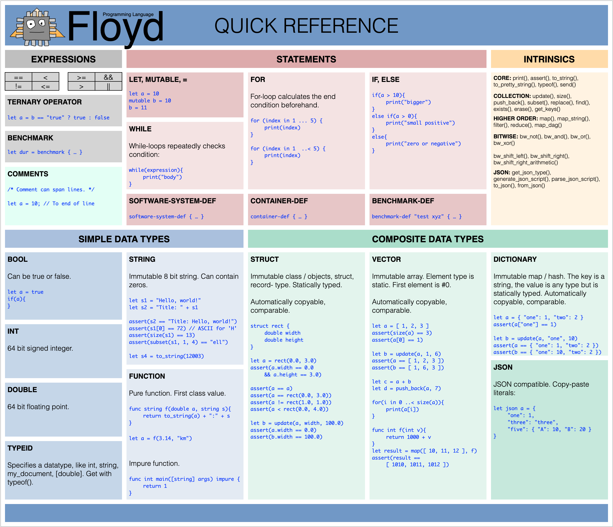

License: MIT

Status: Alpha. All the basics of the language are finished and robust. Runs on bytecode interpreter. Will run natively soon. Production ready for smaller programs. The next step is implementing the LLVM backend and the data structure optimisation features.

[ROADMAP](https://github.com/marcusz/floyd/projects/1 "Floyd Roadmap")

[CURRENT MILESTONE](https://github.com/marcusz/floyd/projects/4 "Milestone 2")

This repo holds the compiler, the bytecode interpreter and documentation.

# WHAT IS FLOYD?

Floyd is a general-purpose programming language designed for making very large and robust programs that run really fast, while ducking many of the problems of older languages. Floyd wants to become a better choice than C++, Rust, C#, Python and Javascript for any project.

The goal is to make a programming language that:

- Executes faster than the same programming written in C or C++ - it should become the preferred language to write a video game engine with, for example

- Makes it fast and simple to program - less accidental complexity

- Helps you make big programs that are fun and straight forward to work on for a long time

- Simple built-in support for concurrency and parallelism

How can this level of execution speed be reached? By designing Floyd to give exceptional freedom to the compiler and runtime to drastically control the mapping of the program's execution to the hardware. The programmer supervises this mapping interactively using a profiler-like tool. This is done separately from writing the program logic. Precise selection of data structures, exact memory layouts, data packing, hot-cold data, hardware caches, thread tasks priorities, thread affinity and so on.

Floyd separates your program into three separate concerns:

1. Writing the program logic
2. Programming internal concurrent processes and how they access the outside world
3. Mapping the program to the CPU and memory system

Floyd compilers and tools are written in C++ 17 and compiles with Clang and GCC.

Floyd's web page: [www.floydlang.org](https://www.floydlang.org "Floyd language's Homepage")

## LANGUAGE SYNTAX

Floyd looks like Javascript and has a lot fewer features, syntax and quirks than most languages. Floyd is **statically typed** with **type inference**. It's got built in types for vectors, dictionaries, JSON, a struct type and strings. All values are **immutable** / **persistent data structures** using HAMT and other techniques.

*Notice that the last example gives you a NEW dictionary - it doesn't change the old one*

It's a mashup of imperative, functional and OOP. Functions defaults to **pure** (but with normal local variables).

Floyd has no classes, no pointers / references, no tracing GC (uses copying and RC), no threads, mutexes, atomics and no header files. No Closures. No generics.

TBD: protocol type for simple polymorphism, basic encapsulation feature, sum-type and limited lambdas.

## CONCURRENCY, STATE AND THE WORLD

Processing and concurrency is done using Floyd's virtual processes and message passing. Each Floyd process has its own private state and is sandboxed. Floyd processes can interact with the world, calling OS APIs and accessing files. Keep this code small, with minimal logic.

The bulk of your program should be blue code - pure code.

## PARALLELISM

*(Implementation in progress)*

Safe parallelism is built in using map() reduce() filter() and supermap(). Like shaders running on a GPU. They share an internal OS thread team with the Floyd processes.

## BYTECODE AND NATIVE

Floyd runs on a bytecode interpreter (now) and natively using LLVM (implementation in progress). Both will be available.

## OPTIMIZATION

*(Implementation in progress)*

You optimise your program by running it and *augmenting* your Floyd processes and their function call graph. Each process has its own optimisation settings. This automatically generates new optimized versions of affected functions. This cannot introduce defects! Examples:

- Change memory layout of structs, order, split, merge, array-of-structs vs struct-of-arrays.
- Select backend for collections: a dictionary can be an array with binary search, a HAMT, a hash table or a red-black tree - all with different performance tradeoffs.
- Control thread priority, affinity, how many threads to use for the parallelization features.
- Insert read or write caches, introduce batching.

# INSTALLATION

There is no compiled distribution of Floyd yet. You need to clone the github repository and build yourself.

#### MACOS

1. Clone the Floyd repository from Github. Use the master branch

2. Install the Homebrew package manager, if you don't already have it. https://brew.sh/

3. In your terminal, run "brew install llvm@8.0.0" -- this installs the LLVM library on your Mac. It's installed in "/usr/local/Cellar/llvm/8.0.0_1" - so it won't conflict with Xcode or other versions of LLVM.

4. Open the Floyd xcode project: Floyd/dev/floyd_speak.xcodeproj

5. Make sure the current xcode scheme is "unit tests". Select from the top-left popup menu, looking like a stop-button.

6. Select menu Product/Run

	This builds the project and runs the unit tests. Output in the Xcode console.
	
#### UNIX

TBD

#### WINDOWS

TBD

# STATUS

The essentials of Floyd are up and running and very robust (approximately 1000 tests), including the concurrent Floyd processes. The compiler generates bytecode that runs at about 5-10% of native speed on the interpreter. The manual is complete.

A handful features are needed for a satisfying 1.0: rounding out the language features somewhat and then *it's all about performance*.

# IN THE BOX

|Item				| Feature	
|:---				|:---
| [Floyd Manual](floyd_manual/floyd_manual.md) | Programming language manual
| [Core Library Manual](floyd_manual/floyd_speak_corelibs.md) | File system access, JSON support, hashes, map() etc.
| **Floyd compiler** | Compiles Floyd source code to byte code
| **Floyd bytecode interpreter**	|Runs your program

# LOOKING FORWARD

[ROADMAP](https://github.com/marcusz/floyd/projects/1 "Floyd Roadmap")

[CURRENT MILESTONE](https://github.com/marcusz/floyd/projects/4 "Milestone 2")
